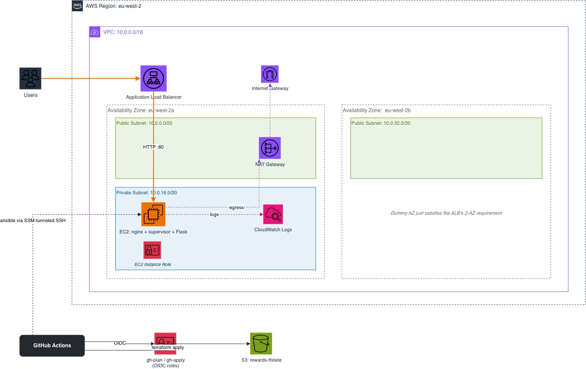

# Rewards

A small Flask service. Runs on EC2 behind an ALB.

## Menu

| Menu item | Link/URL |
|---|---|
| Live health check | http://rewards-dev-alb-1269306359.eu-west-2.elb.amazonaws.com/healthz |
| Demo video | [Loom](https://www.loom.com/share/b4cf00e99130412893e42e6d12e48262) ([backup](https://drive.google.com/file/d/1dJ1hBPHMnDqv-UUm-Eau2THRx3eOaTCn/view?usp=sharing)) |
| Stack | [Stack](#stack) |
| Cloud Architecture | [Cloud Architecture](#cloud-architecture) |
| Run the app locally | [Run the app locally](#run-the-app-locally) |
| Design rationale & trade-offs | [SOLUTION.md](SOLUTION.md) |
| Observability | [SOLUTION.md](SOLUTION.md#observability) |
| Cleanup | [SOLUTION.md](SOLUTION.md#cleanup) |

## Stack

- **App**: Flask, Python 3.
- **Reverse proxy**: Nginx.
- **Process manager**: Supervisor.
- **Infrastructure as Code**: Terraform.
- **Configuration management**: Ansible, over SSH through an SSM tunnel.
- **CI/CD**: GitHub Actions. OIDC.
- **Cloud**: AWS. EC2, ALB, VPC, NAT Gateway, Internet Gateway, CloudWatch Logs, IAM,
  S3.

## Cloud Architecture



One environment: dev. One Availability Zone for compute. A second Availability Zone exists only because ALBs need
two. A single NAT Gateway gives the private
subnet outbound internet access for package installs and the SSM agent. Nothing can
reach it from outside.

GitHub Actions authenticates via OIDC. No static AWS credentials live in GitHub Secrets. It assumes IAM roles for authorization. Deploys run over an SSM tunnel Ansible
establishes at runtime.

## Run the app locally

```bash
python3 -m venv .venv && source .venv/bin/activate
pip install -r requirements.txt

cp env.sh.example env.sh
source env.sh
python app.py              # listens on 0.0.0.0:8080
```

```bash
curl localhost:8080/healthz    # {"service":"rewards","status":"ok","commit":"local","region":"eu-west-2"}
```

In production, Ansible's `rewards` role generates `env.sh` instead
(`ansible/roles/rewards/templates/env.sh.j2`). `APP_SECRET` comes from a GitHub
Actions secret. It is not part of the code that is committed to version control.
