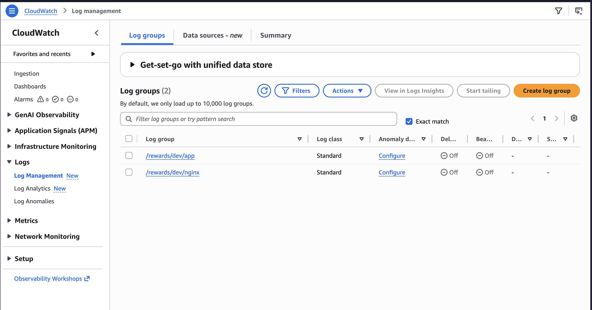
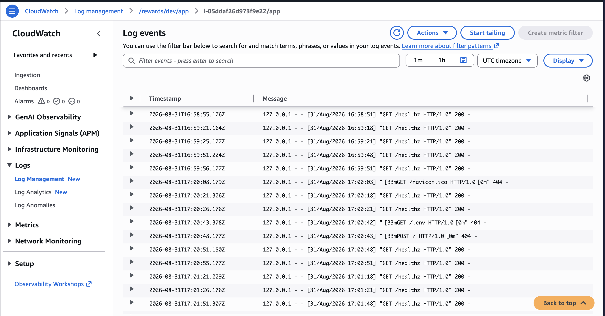

# SOLUTION.md

## Architecture

```
Internet
   │  :80
   ▼
ALB (public subnets, 2 AZs, AWS requires it)
   │  :80, only from the ALB's security group
   ▼
EC2 (private/"protected" subnet, single AZ) ── Nginx :80 → Gunicorn-free Flask dev
server :8080 (loopback only), see "Flask dev server, not gunicorn" below
   │
   ├── Supervisor keeps the app running across crashes/reboots
   └── CloudWatch agent tails nginx + app logs → CloudWatch Logs
```

Only the dev environment exists: one availability zone for compute, a second "dummy" availability zone. A single NAT gateway gives outbound internet access to the resources in the private subnet.

## Observability

CloudWatch Logs is the chosen path, over metrics and alarms, since the ask was to centralize
logs. The CloudWatch agent (installed by the `common` role) ships two log groups per
environment, `nginx` and `app`, and Ansible's `rewards` role points it at both the Nginx access
log and the app's own log file.



`/rewards/dev/app` and `/rewards/dev/nginx`, one stream per instance ID, created by Terraform
(`terraform/modules/logging`) and populated by the agent.



Live `/healthz` requests hitting the Flask dev server, tailed straight from the instance without
needing to SSM in. A couple of `404`s in there too, port scanners probing `/favicon.ico` and
`/.env`, exactly the kind of noise centralized logs make visible.

## Provisioning AWS (one-time setup, then CI takes over)

When it comes to bootstrapping, Terraform's state bucket and the CI trust setup (OIDC
provider, IAM roles) are one-time, manual steps by design. The commands used to provision it are:

```bash
# 1. Generate the deploy keypair. Ansible's plain SSH tunnels through SSM with this,
#    no inbound port 22 anywhere. The .pub contents are set in the variable ssh_public_key in dev.tfvars.
ssh-keygen -t ed25519 -f rewards_server_deploy_key -N ""

# 2. scripts/bootstrap.sh creates the Terraform state bucket, the OIDC provider, and the IAM roles and policies. These are run locally with my AWS credentials once.
GITHUB_ACCOUNT=allansifuna GITHUB_REPO=SimpleApp \
  ./scripts/bootstrap.sh
```

The script prints 2 role ARNs that I then set as GitHub Actions environment variables.

Then, in the GitHub repo:
- These two **Environments**, `dev-plan` and `dev-apply`, are created manually.
- Add an `AWS_ROLE_ARN` **variable** to each, using the two ARNs the script printed.
- Add two **secrets** to the `dev-apply` Environment:
  - `APP_SECRET`: Some secret test that will be displayed in the json response.
  - `SSH_PRIVATE_KEY`: the contents of `rewards_server_deploy_key` from step 1.

From then on:
- **Pull requests touching `terraform/**`** get a `terraform plan` posted as a PR comment, after formatting and validation checks are executed.
- **Any merge to `main`** runs `terraform apply` for infra changes.

## Running Ansible by hand

For running Ansible locally, you'll need AWS credentials with sufficient SSM permissions,
`ansible-core`, and the AWS CLI's `session-manager-plugin`.

```bash
# grab instance name from terraform output
cd terraform/envs/dev
HOSTS_JSON=$(terraform output -json instance_ids | jq -c '[.[] | {(.): {ansible_host: .}}] | add')
yq -i ".rewards_server.hosts = ${HOSTS_JSON}" ../../../ansible/inventory/rewards_server.yml

cd ../../../ansible
cp /path/to/rewards_server_deploy_key .
APP_SECRET=some-sample-value \
  ansible-playbook playbook.yml --extra-vars "commit=$(git rev-parse --short HEAD) region=eu-west-2"
```

## Verifying a deploy

```bash
ALB=$(terraform -chdir=terraform/envs/dev output -raw alb_dns_name)
curl "http://$ALB/healthz"
```

## Key design decisions

**AWS SDK-free access: SSM Session Manager tunnels plain SSH.** The EC2 instance sits in a
private subnet with no inbound port 22 and no public IP. Ansible still reaches it with its
default, built-in `ssh` connection plugin by pointing OpenSSH's `ProxyCommand` at
`aws ssm start-session --document-name AWS-StartSSHSession`. The SSM agent (through the
`AmazonSSMManagedInstanceCore` policy on the instance role) carries the TCP stream; actual
authentication is the SSH keypair that was generated by hand: the public half is set as the instance's SSH keypair through Terraform, and the private half is a
GitHub Actions secret (`SSH_PRIVATE_KEY`).
This keeps the network posture strict since nothing reaches the instance except through the ALB
or an authenticated SSM session while keeping the Ansible side genuinely simple.

**APP_SECRET is a GitHub Actions secret.** I considered Ansible Vault to store the application secret. This enables application secrets to live closer to the configuration logic, but its downside is that you now have to manage/store the vault password, as compared to GitHub Actions secrets, which offer an equal if not more secure way of storing secrets without worrying about the encryption.


**State backend: S3 with native locking, no DynamoDB table.** `use_lockfile = true` (introduced in Terraform ≥ 1.10) gives multi-writer safety via S3 conditional writes instead of a separate lock table.
One fewer resource to provision, pay for, and lose track of, appropriate for one dev environment
and a small team. Trade-off: fewer resources to manage, and lower cost.

**The state bucket itself isn't Terraform-managed.** A Terraform config that creates its own
backend has nowhere to put its own state: locally (now two state files to think about) or
migrated into itself (circular). It's a true one-time action that almost never changes, so it's
created by hand once (see README.md) and never given its own Terraform lifecycle.

**Tags via `default_tags`.** `environment`, `service`, `owner`, `cost_center` are set once on
the AWS provider block (`terraform/envs/dev/providers.tf`) rather than repeated on every
resource. Every resource this config creates gets them automatically.

**GitHub OIDC, instead of raw AWS credentials.** Security in the runners begins with short-lived credentials, dynamically generated via OpenID Connect for authentication, and least-privilege IAM roles for authorization.

## Promoting to prod

- Add `terraform/envs/prod/` mirroring `envs/dev/` (same modules, a `prod.tfvars`, its own
  state key). Nothing in `modules/` is dev-specific.
- Add a `prod` GitHub Environment with its own `gh-apply`-equivalent role (same OIDC provider,
  a trust condition scoped to a `prod` deploy trigger, a tag, say, or a manual
  `workflow_dispatch`, rather than every push to `main`) and its own `APP_SECRET` /
  `SSH_PRIVATE_KEY` secrets, and require a manual approval on that Environment.
- Swap the Flask dev server for gunicorn (see above), add an ACM cert + HTTPS listener on the
  ALB.

## Cleanup

```bash
terraform -chdir=terraform/envs/dev destroy -var-file=dev.tfvars
# only once you're fully done with the exercise, delete the state bucket by hand too and the IAM roles.
aws s3 rb s3://rewards-tfstate --force
```

## Working with AI

I used Claude Code as a pair programmer, doing some code generation, proofreading and linting syntax, and generating documentation. A few prompts that shaped
the build:

Validating my architecture diagram in the plan phase:
> "As a senior cloud engineer critique my architecture design and give suggestions on areas of improvement"

Adding SSH proxying through Amazon SSM tunneling:
> "I am thinking of having Ansible access the EC2 instance through the Session Manager, what is the command to do that?"

Writing Terraform modules:
> "Now that you have a good look at the architecture diagram, let's generate the terraform modules for the infrastructure, be pragmatic and minimalist"

Generating Markdown files:
> "Write a README.md file describing in one line what "rewards" is and add a menu section and a way to run the application locally"

